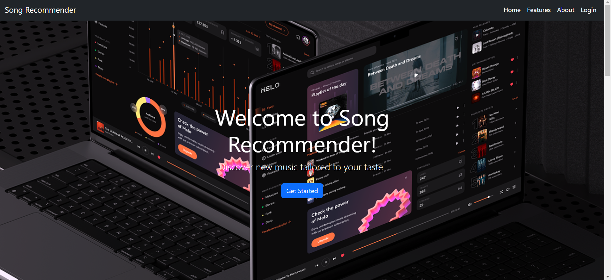

<h1>SongRecommender</h1>

<h2>Introduction</h2>

SongRecommender is a web application designed to enhance music discovery by providing personalized song recommendations based on user preferences and listening behavior. Leveraging the Spotify API, it aims to create an engaging platform where users can explore and discover new music tailored to their tastes.

<h2>Project Screenshot</h2>

<h3>Deployed Site:</h3>

<a href="https://song-recommender-1.onrender.com/">SongRecommender</a>

<h3>Final Project Blog Article:</h3>

<a href="https://medium.com/@natiseifu02/song-recommender-0aaafa62dcae">SongRecommender Project Blog</a>

<h3>Author(s) LinkedIn:</h3>

    <a href="https://www.linkedin.com/in/natnael-seifu/">LinkedIn Profile</a>

<h2>Developer</h2>

    <strong>Natnael Seifu</strong> 
    Contact: <a href="mailto:natiseifu02@gmail.com.com">natiseiuf02@gmail.com</a>

<h2>Installation</h2>

To run SongRecommender locally, follow these steps:

<h3>Clone the repository:</h3>
<pre><code>git clone https://github.com/naty1914/SongRecommender.git</code></pre>
<pre><code>cd SongRecommender</code></pre>

<h3>Install dependencies:</h3>
<pre><code>pip install -r requirements.txt</code></pre>

<h3>Set up environment variables for Spotify API credentials in a .env file:</h3>
<pre><code>CLIENT_ID=your_spotify_client_id</code></pre>
<pre><code>CLIENT_SECRET=your_spotify_client_secret</code></pre>
<pre><code>REDIRECT_URI=your_redirect_uri</code></pre>

<h3>Run the application:</h3>
<pre><code>python3 app.py</code></pre>

Access SongRecommender at <a href="http://localhost:5000">http://localhost:5000</a> in your browser.

<h2>Usage</h2>
<ul>
    <li><strong>Signup and Login:</strong> Users can sign up or log in using their Spotify account.</li>
    <li><strong>Music Recommendations:</strong> Explore personalized song recommendations based on your listening habits.</li>
    <li><strong>Snippet Preview:</strong> Listen to 30-second snippets of recommended tracks.</li>
    <li><strong>User Profile:</strong> View and manage your profile information including email, display name, and country.</li>
</ul>

<h2>Contributing</h2>

Contributions are welcome! If you'd like to contribute to SongRecommender, please fork the repository and submit a pull request with your proposed changes.

<h2>Related Projects</h2>
<ul>
    <li><a href="https://developer.spotify.com/documentation/">Spotify API Documentation</a></li>
    <li><a href="https://flask.palletsprojects.com/">Flask Documentation</a></li>
</ul>

 <h2>Advanced Details</h2>
<h3>Development Challenges</h3>

I faced challenges in making sure the app runs fast and updates information in real-time. To improve this, I used techniques to store data temporarily and handle multiple tasks at once, which made the app feel faster and more responsive.

<h3>Future Improvements</h3>

Looking forward, I plan to make the song suggestions even better and explore more ways to personalize the app based on user feedback.

<h3>Passion Project</h3>

This project shows my passion for combining music and technology to make tools that people enjoy using.

